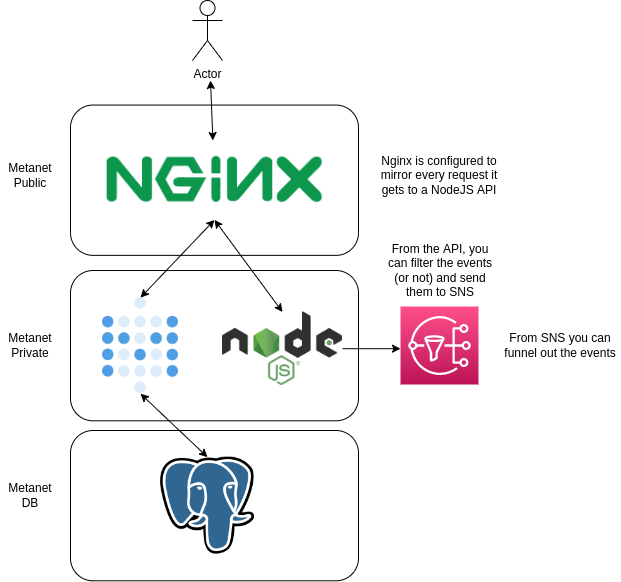

# metabase-pub-sub-nginx
Nginx acting as a reverse proxy that mirrors traffic to an API that sends data to SQS for pub/sub

## How to run this project?

1) Install Docker 20.10+
2) Create a topic in aws sns and a subscriber (like an https endpoint in requestbin to validate that the flow is working accordingly)
3) Complete the environment variables in docker-compose.yaml (AWS_ACCESS_KEY_ID, AWS_SECRET_ACCESS_KEY and AWS_TOPIC_ARN). You need an access key in AWS that can publish messages to a topic
4) Do docker compose up

## How does this work?

Nginx provides a feature to mirror every single request it gets to other upstreams (check default.conf in nginx folder), so in this case is mirroring everything to a Node.JS endpoint that is listening to any verb and filters only the requests that are being done to /api/. From there, you can code any custom logic in the endpoint to either filter the relevant events you need or you can send everything without filtering to SNS from where you can integrate with any AWS service in a pub/sub type of architecture.

## Overal architecture

## Pending

More examples, the project was done in one afternoon as a PoC.
